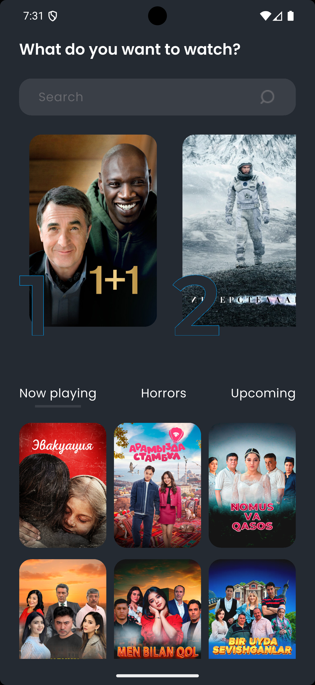

# 🎬 Flutter Movies App  
**Мобильное приложение на Flutter с использованием чистой архитектуры (Clean Architecture + Feature-first)**  

---

## 📸 Скриншоты  
      

---

## 📖 Описание  
**Flutter Movies App** — приложение, построенное на принципах **чистой архитектуры**, с разделением на слои `Data / Domain / Presentation`.  
## 🚀 Реализованный функционал  
✔ Получение списков разных категорий фильмов на стартовой странице                            
✔ Cubit управление состояниями                                          
✔ Разделение приложения по слоям (Clean Architecture)                                    
✔ Подключение зависимостей через GetIt                                            
✔ Кэширование изображение через Сached_network_image                                            
✔ Поиск фильмов                                            
✔ Страница подробной информации о фильме                                            
✔ Локализаця - ru, en (пока без API)                                            

---

## 🧱 Стек технологий  
- **Flutter**  
- **Dart**  
- **Bloc (Cubit)**  
- **GetIt**  
- **Cached_network_image**  
- **Dio**  
- **Clean Architecture**
- **Flutter Intl**  

---

## 📂 Структура проекта  
lib/                                                      
├── core/                                                   
│ └── di/                                
│ └── network/                                
│ └── theme/                                
│ └── widgets/                                
├── features/                                             
│ └── movies/                                    
│   ├── data/                                                 
│   │ ├── datasources/                                 
│   │ ├── models/                                   
│   │ └── repositories/                                   
│   ├── domain/                                   
│   │ ├── entities/                                   
│   │ ├── repositories/                                   
│   │ └── usecases/                                   
│   └── presentation/    
│   │ ├── cubits/                                   
│   │ ├── pages/                                   
│   │ └── widgets/
│ └── search/                                    
│   ├── data/                                                 
│   │ ├── datasources/                                 
│   │ ├── models/                                   
│   │ └── repositories/                                   
│   ├── domain/                                   
│   │ ├── entities/                                   
│   │ ├── repositories/                                   
│   │ └── usecases/                                   
│   └── presentation/    
│   │ ├── cubits/                                   
│   │ ├── pages/                                   
│   │ └── widgets/                                            
│                             
└── main.dart                                   

---

## 📌 В планах реализации  
- ⭐ **Добавление фильмов в избранное (локальное хранилище)**  
- 🌓 **Поддержка тёмной и светлой темы**  

---

## 💻 Установка и запуск  
```bash
git clone https://github.com/VladIsLuv-N/movies_app.git
cd movies_app
flutter pub get
flutter run
